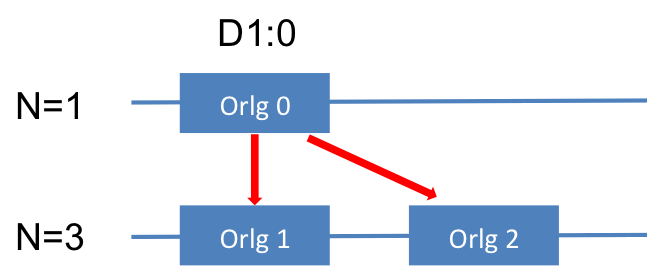
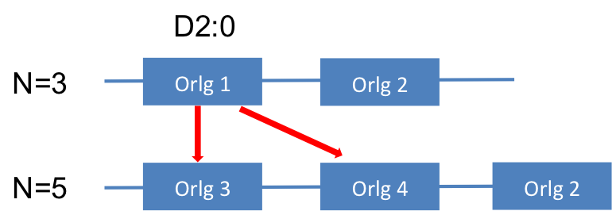
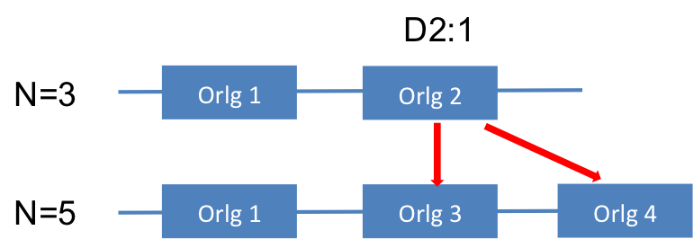

There are two versions of the softwawre that both implement the independent site IGC expansion.
The first version assumes one single duplication event without loss events. The second version is supposed to relax this constraint on the gene duplication loss history.

Another difference is that the new version only supports nucleotide substitution model whereas the old version supports both nucleotide substitution model and codon model.  The reason is that the size of the state space increase exponentially with the number of contemporaneous paralogs.  When using a codon subsitution model as a base point mutation model to add IGC in, the maximum possible number of paralog to consider is only 2.  There is no point of considering more than two paralogs with the codon based models. 

## New version

I'll start with how to use the new version.  For independent site IGC model (IS-IGC), please refer to the [IS-IGC folder](https://github.com/xji3/IGCexpansion/tree/master/tutorials/IS_IGC_New) for example input files with a python script that imports the package and runs the analysis.

#### Run the Tutorial

```
cd IGCexpansion/tutorials/IS_IGC_New
python Run_IS_IGC_New.py
```

#### Input Files
This section describes the input files and their supposed format for running the analysis.
The table below summarizes all input files (as the variable name in the [script](https://github.com/xji3/IGCexpansion/tree/master/tutorials/IS_IGC_New/Run_IS_IGC_New.py)) followed with their more detailed descriptions.

| File | Description |
|-------------|:-------|
| [alignment file](#alignment) | Multiple sequence alignment file |
| [newicktree](#newick) | Specis tree file stored in the Newick format |
| [DupLosList](#DupLosList)| A file describes the duplication loss events on the branches of the newick tree |
| [gene\_to\_orlg_file](#gene_to_orlg) | A file describes the orthologous group each gene belongs to |
| [seq\_index\_file](#seq_index) | A file describes corresponding sequence position of each column in the alignment |

##### <a name='alignment'>alignment file</a>
The alignment file is in fasta format.

However, the name of the gene follows a rather weird rule:
it is combined by the species name and gene name with a double underscore **"\__"** connecting them. For example, **Human** **EDN** gene would be denoted as **"Human\__EDN"** this way.  The double score is used to allow species / gene names to have single scores. For example, a **Tree\_Shrew** **EDN** gene would be **Tree\_Shrew__EDN**.  

Please use this [example alignment file](https://github.com/xji3/IGCexpansion/tree/master/tutorials/IS_IGC_New/EDN_ECP_Cleaned_NewFormat.fasta) as a reference.


##### <a name='newick'>newick tree</a>

The tree file describes the species tree in newick format.

However, unlike usual newick files, all internal nodes have to be named in this tree file for later uses to define the duplication loss history along this species tree (to point events to the right branch). A convention I have been using is to name them by "N" + number, e.g. N0, N1... I usually start the numbering from the root to the tip.

Please use this [example tree file](https://github.com/xji3/IGCexpansion/tree/master/tutorials/IS_IGC_New/EDN_ECP_tree.newick) as a reference.

##### <a name='DupLosList'>DupLosList</a>

This text file provides the duplication / loss events on each branch of the species tree.  

Each row starts with the branch name that consists the two node names with an underscore in between. 
Following the branch name are all the events (both duplication and loss) on this branch by their chronological order and are separated by spaces.
A duplication event is named with "D" + "duplication event number".
A loss event is named with "L" + "loss event number". Therefore, this file defines the orthologous group (described in [gene\_to\_orlg\_file section](#gene_to_orlg)) on this tree.  

The branches in this file are parsed by a strange order defined by the `terminal_node_list`.  For each terminal node in the list, the duplication/loss event parser travels from the root node to this terminal node and parses the duplication/loss events on un-visited branches.  For each event on the branch, the parser represents it by creating a new degree 2 node on the branch (which violates the newick format).

Orthologous groups (Orlg) are defined while parsing the duplication loss history on the species tree. I assume the Orlg always starts with one gene (multigene family of size one) with the max Orlg number N=1. As a convention of the python language, the numbering of Orlg starts from 0.  The `node_to_pos` dictionary defines the Orlg on the node that the specified event takes place.  For example, `D1:0` means that the first duplication event takes place at the first Orlg on this node.  When a duplication event happens, it produces two new Orlgs (N and N+1) and the max Orlg number N increments by 2 (N += 2).  



This Orlg configuration on each node (including internal speciation, duplication and loss nodes) gives the exact one-to-one orthologous mapping between genes.  A more complicated example considers the next duplication event when N=3.  Now there are two possible places (genes) where the duplication event can happen: Orlg1 and Orlg2.  When the duplication event happens at Orlg1 `D2:0`, the new configuration is [Orlg3, Orlg4, Orlg2] with N = 5.



When the duplication event happens at Orlg2 `D2:1`, the new configuration is [Orlg1, Orlg3, Orlg4] with N = 5.



Unlike duplication events that produce new Orlgs, the deletion events only flag Orlgs to be missing (in other words delete the Orlg on that branch).

The last kind of internal nodes on the tree represents speciation events.  For the speciation nodes, the configuration is copied from its parent node and is passed onto its descendant nodes.


Please use this [example DupLosList file](https://github.com/xji3/IGCexpansion/tree/master/tutorials/IS_IGC_New/EDN_ECP_DupLost.txt) as a reference.

##### <a name='gene_to_orlg'>gene\_to\_orlg\_file</a>

This is probably the weirdest input of the current version.
It is partly redundant with the DupLosList.  
The Orlg configuration of the tip nodes are the same as their parent nodes.  This gene\_to\_orlg file gives the mapping between extant paralogs to their Orlgs.  The configuration of each species has to match that on the species tree defined by the DupLosList (this is redundant but I kept it for sanity checks).

Please use this [example gene\_to\_orlg file](https://github.com/xji3/IGCexpansion/tree/master/tutorials/IS_IGC_New/EDN_ECP_GeneToOrlg.txt) as a reference.

##### <a name='seq_index'>seq\_index\_file</a>

This file tells the program where each column in the multiple sequence alignment is on the reference gene sequence (we don't need to worry for this if there were no indels). The current approach is pretty crude that assumes there are no gaps on the reference sequence...

Anyway, the first column of the seq_index file represents the corresponding sequence position on the reference gene.  For protein coding genes, the second column shows the codon number and the third column shows the codon position.

Please use this [example seq\_index file](https://github.com/xji3/IGCexpansion/tree/master/tutorials/IS_IGC_New/EDN_ECP_seq_index.txt) as a reference.

## Old version

Although being the old versoin, the input files are pretty similar (but less) to those of the "new" version.

The alignment file is also in fasta format.
The gene names are made by directly concatenate the species name with the paralog name.  The program will trim off the paralog name after reading in.  The 'strange' requirement is that it assumes the two paralog names are of the same length.

For independent site IGC model (IS-IGC) with either HKY or MG94 model as the base point mutation model, please refer to the [IS-IGC-Old folder](https://github.com/xji3/IGCexpansion/tree/master/tutorials/IS_IGC_Old) for example input files with a python script that imports the package and runs the analysis.

#### Run the Tutorial

```
cd IGCexpansion/tutorials/IS_IGC_Old
python Run_IS_IGC_Old.py
```

#### Output files

The results are saved in a summary text file.
The file contains a column of numbers followed by a row of names for each number in the column.
The default summary file contains the maximum likelihood estimates (MLE) of all the parameters in the model.


If the `get_ExpectedNumGeneconv()` function is called before generating the summary, there will be additional numbers for expected number of certain transitions in the suumary file.
In this case, these numbers are:

1. Expected IGC rate on each branch.  Format of `branch name` + `tau`.
2. Expected number of IGC transitions on each branch from the first paralog to the second paralog.  Format of `branch name` + `1->2`.
3. Expected number of IGC transitions on each branch from the second paralog to the first paralog.  Format of `branch name` + `2->1`.
4. Expected number of Point mutations on each branch.  Format of `branch name` + `mut`.


